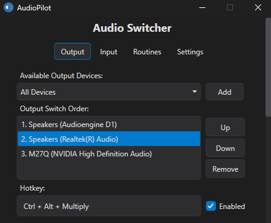
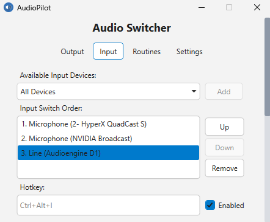
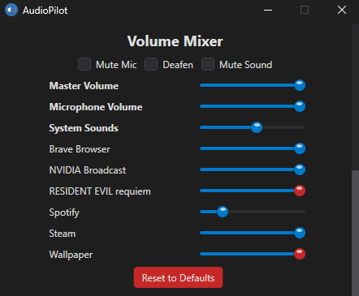
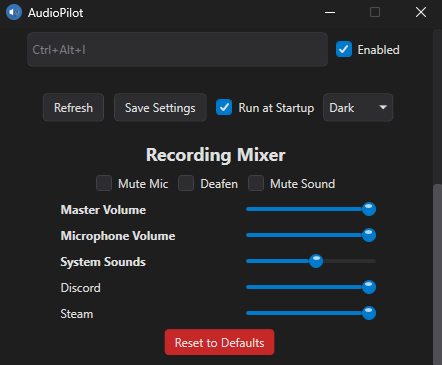
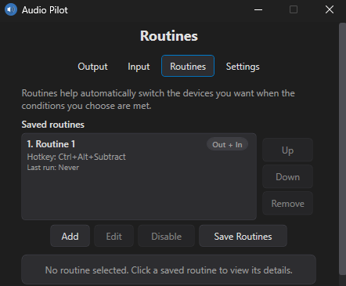

# AudioPilot

[](.github/workflows/ci.yml)
[](https://dotnet.microsoft.com/)
[](LICENSE)

AudioPilot is a Windows desktop app for fast daily audio control.

It is built for people who switch output or input devices often, want reliable global hotkeys, and do not want to dig through Windows audio panels every time their setup changes.

<!-- markdownlint-disable MD033 -->
<p align="center">
  
  
</p>
<!-- markdownlint-enable MD033 -->

## What AudioPilot Does

- Switch output and input devices from global hotkeys, tray commands, routines, or CLI commands.
- Preserve app and session volume levels across output switches when enabled.
- Adjust master output and microphone levels from dedicated hotkeys.
- Control per-app session volume from both the output-facing Volume Mixer and the input-facing Recording Mixer.
- Toggle mute mic, mute sound, deafen, and media actions.
- Toggle Windows input monitoring with optional dedicated monitor output routing.
- Run routines triggered by hotkeys, application launch or focus, scheduled times, network connections, Steam Big Picture, device changes, or tray actions.
- Route one app to a different output device without moving the full system default.

## Get AudioPilot

If you want to use the app, start with the latest release:

- Download: [GitHub Releases](https://github.com/HanuwaDev/AudioPilot/releases)
- Supported OS: Windows 10 version 1809 or later, including Windows 11
- App target: `.NET 10` WPF on `net10.0-windows10.0.17763`
- Installer note: `x64` and `arm64` releases include per-user MSI installers as an alternate install path; portable ZIP packages remain available for all supported architectures
- Runtime note: framework-dependent ZIP packages require the .NET Desktop Runtime 10; self-contained ZIP packages include it

### Which Release Should I Download?

| If your machine is... | Recommended artifact | Why |
| --- | --- | --- |
| Most modern Windows PCs | `SelfContained-win-x64.zip` | Best default choice while releases remain unsigned; includes the runtime and avoids installer trust friction |
| Windows on ARM | `SelfContained-win-arm64.zip` | Best default choice for ARM systems; includes the runtime and avoids installer trust friction |
| Older 32-bit Windows systems | `SelfContained-win-x86.zip` | Use only when you specifically need 32-bit support; MSI is not provided for x86 |
| Standard installed setup on x64 or arm64 | `*.msi` | Alternate per-user installer path if you prefer Add/Remove Programs integration and shortcuts |

### Self-Contained vs Framework-Dependent

| Package type | Choose it when... | Tradeoff |
| --- | --- | --- |
| Self-contained | You want the simplest download-and-run path | Larger download, but no separate .NET install |
| Framework-dependent | You already have the .NET Desktop Runtime 10 installed or want a smaller package | Smaller download, but requires the runtime on the machine |

## Build From Source

Building from source is reasonably straightforward if you are already on Windows and have the .NET 10 SDK installed.

Typical local source-build path:

```powershell
git clone https://github.com/HanuwaDev/AudioPilot.git
cd AudioPilot
pwsh ./scripts/build.ps1
pwsh ./scripts/run-tests.ps1 -Category unit
dotnet run --project AudioPilot/AudioPilot.csproj
```

Notes:

- Source builds are intended for contributors and advanced users on Windows.
- The release artifacts are still the easier path if you only want to use the app.
- The build and test scripts handle the normal restore and build steps, so you do not need a custom setup flow beyond the .NET SDK and PowerShell.

## Start Here

Typical first-run path:

1. Download the release artifact that matches your system.
2. If you chose an MSI, run it. If you chose a ZIP, extract it first.
3. Launch `AudioPilot.exe`.
4. Add the devices you want in the output and input cycle lists.
5. Put each list in the order you want to rotate through.
6. Assign your hotkeys.
7. Save settings.
8. Minimize to tray and test switching.

If you prefer less manual saving, enable auto-save in Settings and click Apply Settings once. After that, AudioPilot automatically persists device, routine, and settings edits after a short debounce.

If you want the full walkthrough, use [docs/USER_GUIDE.md](docs/USER_GUIDE.md).

## Common Workflows

| I want to... | Best place to start | Notes |
| --- | --- | --- |
| Switch between speakers and a headset fast | Main window and tray hotkeys | Configure cycle lists, order, and hotkeys, then run tray-first |
| Change per-app output or input volume without opening Windows panels | Mixer views | Use Volume Mixer for playback sessions and Recording Mixer for input-side sessions |
| Raise or lower output or mic level quickly | Settings hotkeys | Configure dedicated up and down hotkeys with step percentages |
| Monitor microphone input | Settings or CLI listen commands | Use Windows "Listen to this device" with optional monitor output target |
| Auto-switch when a game or app starts | Routines | Use app-start routines, with optional app-only routing |
| Keep one app on another device | Routines | Use app-only output routing instead of moving the system default |
| Automate the app from scripts | CLI | Use [docs/CLI.md](docs/CLI.md) as the command reference |

## Why People Use It

- Desk and headset setups that change several times a day.
- Gaming or streaming workflows that need fast mute, deafen, media, and output control.
- Voice-chat setups where one app should stay on a different device.
- Living-room or docked setups that benefit from routines and restore-on-exit behavior.
- Automation-heavy setups that need scriptable status, switching, validation, diagnostics, or config control.

## Project Scope

AudioPilot is intentionally focused on fast local Windows audio control for one machine at a time.

It is not trying to be:

- a general-purpose audio processing suite,
- a cloud-synced settings platform,
- a cross-platform desktop app,
- a DAW, effects rack, or virtual mixer replacement,
- a full remote-management or enterprise deployment system.

That scope is deliberate. The project is optimized for reliable daily switching, hotkeys, routines, tray access, and scriptable automation rather than trying to cover every audio workflow Windows can support.

## User Documentation

- Setup, tasks, troubleshooting, and settings: [docs/USER_GUIDE.md](docs/USER_GUIDE.md)
- Automation and scripting: [docs/CLI.md](docs/CLI.md)
- Release notes: [docs/CHANGELOG.md](docs/CHANGELOG.md)
- Security policy: [docs/SECURITY.md](docs/SECURITY.md)

## CLI Summary

AudioPilot supports command-line control through `AudioPilot.Cli.exe`.

Quick examples:

```powershell
AudioPilot.Cli.exe status --json
AudioPilot.Cli.exe switch output
AudioPilot.Cli.exe switch input --reverse
AudioPilot.Cli.exe listen toggle --json
AudioPilot.Cli.exe diagnostics status --json --redact
AudioPilot.Cli.exe diagnostics export-bundle .\support-bundle.zip --json
```

Execution model summary:

- Commands forward to a running UI instance when available.
- Without a running UI instance, automation-safe commands run headlessly.
- UI-only commands such as `show`, `hide`, and `startup open` require a running UI host.
- Forwarding failures return exit code `4` so scripts can distinguish them from command failures.

Use [docs/CLI.md](docs/CLI.md) for the full command reference, JSON output behavior, exit codes, and automation notes.

## Screens

### Mixer

AudioPilot includes both a Volume Mixer for playback sessions and a Recording Mixer for input-side sessions, so you can rebalance either side without opening Windows audio panels.

<!-- markdownlint-disable MD033 -->
<p align="center">
  
  
</p>
<!-- markdownlint-enable MD033 -->

### Routines

Routines save reusable output and input targets and can react to application launch or focus, Steam Big Picture, device changes, hotkeys, or tray actions.

<!-- markdownlint-disable MD033 -->
<p align="center">
  
</p>
<!-- markdownlint-enable MD033 -->

## Troubleshooting

- Hotkey does nothing: check for a conflict with another app and confirm the hotkey is saved.
- Switch failed: confirm the target device is still connected and active.
- Wireless device seems stale: Bluetooth reconnect preflight may recover it, but a device that stays unavailable still fails the switch.
- Resume behavior seems stale: wait briefly for recovery, then reopen from tray or run `AudioPilot.Cli.exe refresh`.
- Need share-safe diagnostics: use `AudioPilot.Cli.exe diagnostics export-bundle .\support-bundle.zip --json`, or use `AudioPilot.Cli.exe status --json --redact` for a quick snapshot.

For deeper troubleshooting and recovery steps, use [docs/USER_GUIDE.md](docs/USER_GUIDE.md).

## Contributing

If you want to change AudioPilot rather than just use it:

- Workflow and local validation: [docs/CONTRIBUTING.md](docs/CONTRIBUTING.md)
- Architecture and implementation guidance: [docs/DEVELOPER_GUIDE.md](docs/DEVELOPER_GUIDE.md)
- Release process: [docs/RELEASING.md](docs/RELEASING.md)

Quick local loop:

```powershell
pwsh ./scripts/build.ps1
pwsh ./scripts/run-tests.ps1 -Category unit
dotnet run --project AudioPilot/AudioPilot.csproj
```

## Support Expectations

AudioPilot is maintained by one person.

- Issues and pull requests are welcome.
- Response time is best-effort rather than guaranteed.
- Small, focused fixes and clear repro steps are much easier to act on than broad requests.

If you are opening an issue, include the shortest reproducible setup you can, and use redacted diagnostics unless exact paths or names are needed.

## Repository Docs

- [docs/USER_GUIDE.md](docs/USER_GUIDE.md)
- [docs/CLI.md](docs/CLI.md)
- [docs/DEVELOPER_GUIDE.md](docs/DEVELOPER_GUIDE.md)
- [docs/CONTRIBUTING.md](docs/CONTRIBUTING.md)
- [docs/RELEASING.md](docs/RELEASING.md)
- [docs/DOCS_STYLE_GUIDE.md](docs/DOCS_STYLE_GUIDE.md)
- [docs/CHANGELOG.md](docs/CHANGELOG.md)
- [docs/SECURITY.md](docs/SECURITY.md)
- [CODE_OF_CONDUCT.md](CODE_OF_CONDUCT.md)

## License

MIT License. See [LICENSE](LICENSE).
